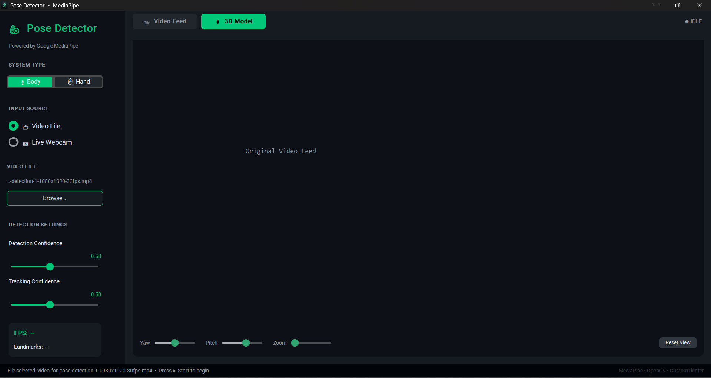
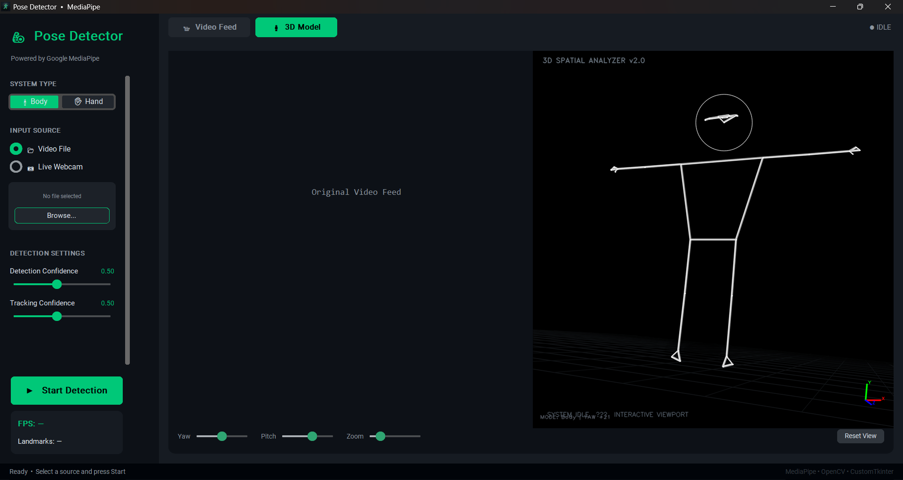
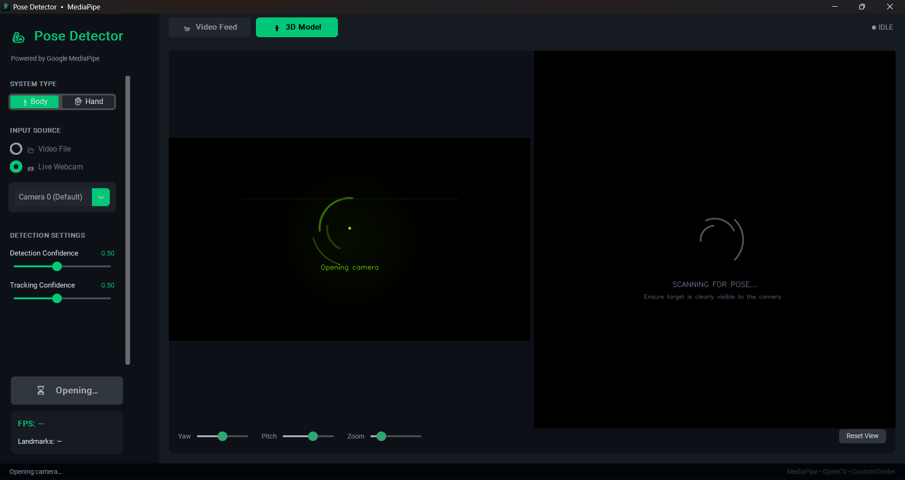
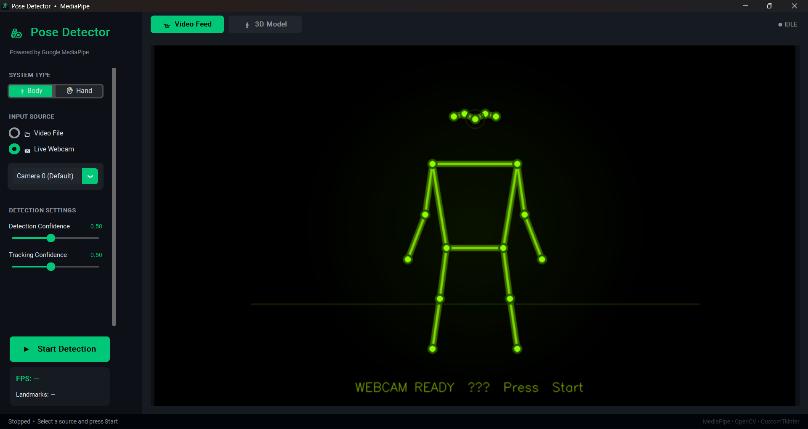

# 3D Pose & Hand Detector

[](https://www.python.org/)
[](https://developers.google.com/mediapipe)
[](https://github.com/TomSchimansky/CustomTkinter)

A professional, high-performance desktop application for real-time **2D and 3D Human Pose & Hand tracking**. Built with a sleek dark-themed GUI, this tool leverages Google's MediaPipe Tasks API and a custom-built, vectorized 3D rendering engine.



---

## Key Features

- **Dual-Tracking System:** Instantly switch between full-body **Pose Detection** (33 landmarks) and high-fidelity **Hand Landmark Detection** (21 landmarks per hand).
- **True 3D World Space:** Unlike basic screen-space tracking, this tool extracts physical 3D coordinates in meters, providing accurate depth and human proportions.
- **Dual-View Analysis:** Compare the raw video feed with a synchronous **3D Skeletal Mirror** side-by-side. 
- **Interactive 3D Viewport:** Freely rotate (Yaw/Pitch), Zoom, and Pan the 3D model using mouse controls or dedicated UI sliders to inspect movement from any angle.
- **Performance Optimized:** 
    - **Vectorized Rendering:** Uses NumPy vectorization for high-framerate 3D projection.
    - **Async Processing:** Separate threads for inference and GUI rendering to ensure zero-lag interactivity.
    - **UI Throttling:** Smart update locking to prevent event-loop congestion.
- **Responsive Sidebar:** A modern, three-tier sidebar (Header, Scrollable Settings, Fixed Footer) that remains fully accessible on all screen sizes.

---

## Screen Gallery

### Full Body Mode
Real-time 3D skeleton mirroring and landmark tracking.


### Performance & Interface
Depth-sorted volumetric rendering and a responsive, scrollable settings panel.

| **Interactive 3D View** | **Modern Interface** |
|:---:|:---:|
|  |  |

---

## Technical Stack

- **Computer Vision:** [MediaPipe Tasks](https://developers.google.com/mediapipe) (Pose & Hand Landmarkers)
- **GUI Framework:** [CustomTkinter](https://github.com/TomSchimansky/CustomTkinter)
- **Image Processing:** OpenCV & Pillow
- **Math & Physics:** NumPy (Vectorized Coordinate Projection)
- **3D Engine:** Custom lightweight orthographic-to-perspective engine.

---

## Quick Start

### 1. Requirements
- Python 3.9 or higher
- Windows / macOS / Linux

### 2. Installation
Clone the repository and install the dependencies:
```bash
pip install -r requirements.txt
```

### 3. Usage
Launch the application:
```bash
python app.py
```

- **Video File:** Select any .mp4 or .avi to analyze pre-recorded footage.
- **Webcam:** Choose your camera index to start live tracking.
- **System Type:** Toggle between 'Body' and 'Hand' modes on the fly.

---

## Project Structure

- `app.py`: Main GUI orchestration and UI logic.
- `detectors.py`: Unified MediaPipe wrapper for Body/Hand inference.
- `model_3d.py`: Vectorized 3D rendering engine and projection logic.
- `video_source.py`: Thread-safe video capture abstraction.
- `Images/`: High-resolution application screenshots.

---

*Developed for the Computer Vision Community.*
