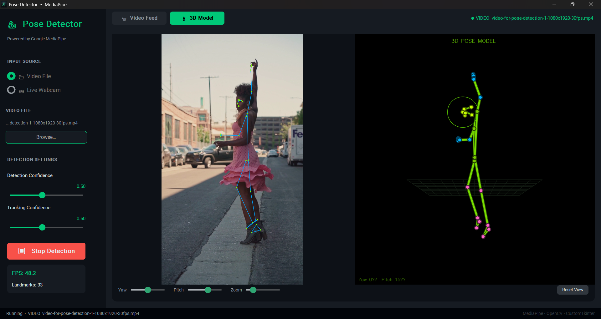
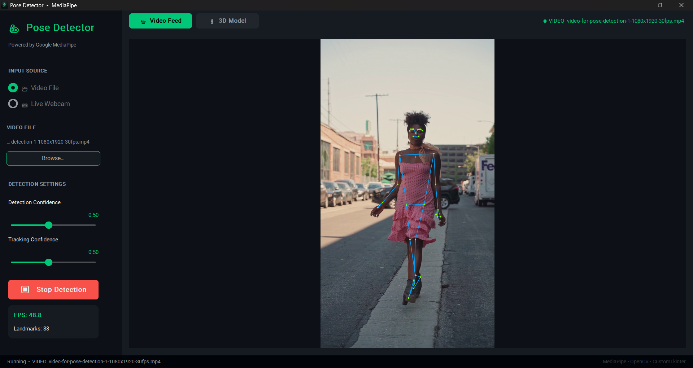
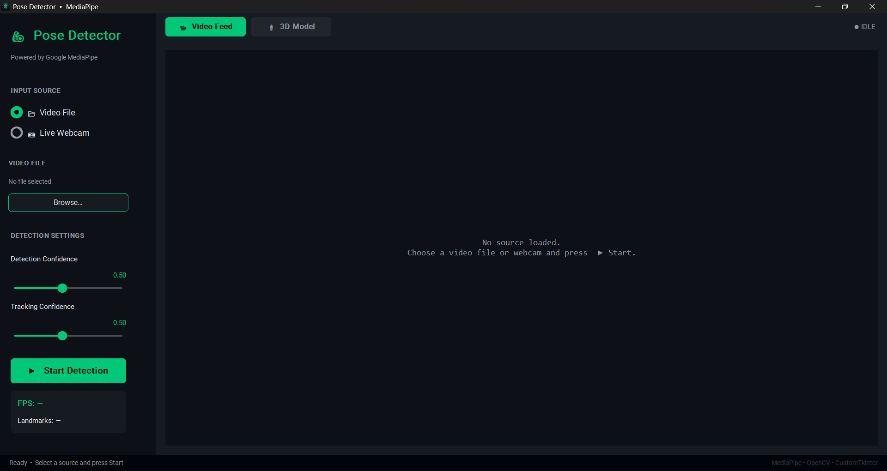
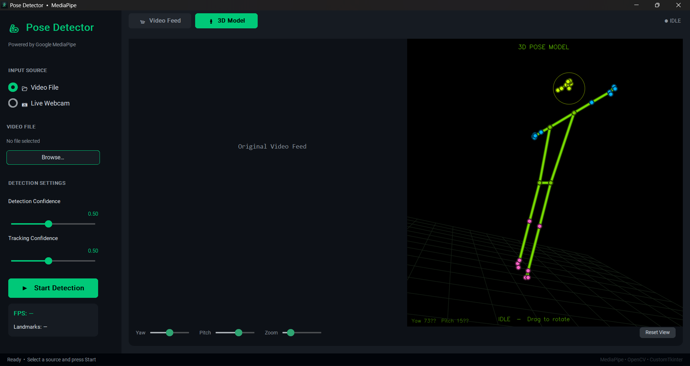
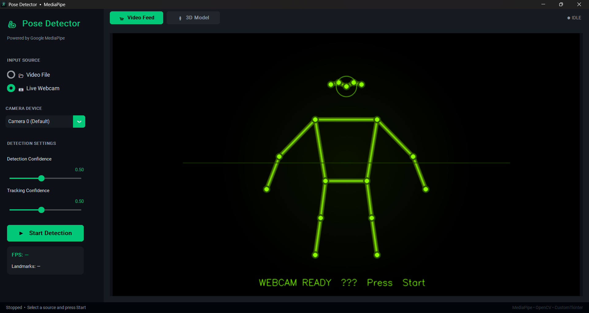

# 3D Pose Detector - MediaPipe & CustomTkinter

A sleek, high-performance desktop application for real-time 2D and 3D human pose detection. Powered by **Google MediaPipe** and built with a modern, dark-themed **CustomTkinter** interface, this tool allows you to analyze human movement from both live webcams and pre-recorded video files. 

It features an innovative **Dual-View System** that projects raw 2D skeletal tracking alongside a fully interactive, depth-sorted 3D spatial model.

---

## Features

- **Dual Input Modes:** Instantly toggle between analyzing a local Video File or a Live Webcam feed.
- **Accurate 3D Spatial Mapping:** Extracts true physical 3D world landmarks (in meters) to guarantee the 3D model maintains accurate human proportions regardless of camera aspect ratio or viewing angle.
- **Side-by-Side 3D Viewer:** Watch the original video feed right next to the interactive 3D model for real-time motion comparison.
- **Interactive 3D Canvas:** Mouse-drag to rotate (Yaw/Pitch) the 3D model, scroll to zoom, or use the dedicated UI sliders to inspect the pose from any angle.
- **Asynchronous Design:** Non-blocking processing threads ensure the CustomTkinter GUI remains smooth and responsive, complete with animated loading screens and idle states.
- **Dynamic Head Tracking:** The 3D model continuously measures the distance between facial landmarks to draw a perfectly scaled boundary that encapsulates the face.
- **Lightweight Engine:** Built entirely using OpenCV projections and Python maths—no heavy 3D game engines (like Unity or OpenGL wrappers) required!

---

## Screenshots

### 3D Side-by-Side Tracking
Watch the 3D skeleton mirror exact human movements in real-time, right alongside the original video.


### 2D Video Pose Detection
Robust 2D skeleton overlays mapping 33 distinct body landmarks.


### Clean, Modern Interface
A beautiful dark-themed dashboard built with `CustomTkinter`.


### Interactive 3D Idle Mode
When detection stops, the 3D model falls back to a sleek, auto-rotating T-pose.


### Animated Webcam Loader
A pulsing neon skeleton entertains you while your webcam hardware initializes.


---

## 🛠️ Architecture

- **`app.py`**: The core application loop and GUI logic (`CustomTkinter`).
- **`pose_detector.py`**: A robust wrapper around `mediapipe.tasks.vision`, handling the heavy lifting of extracting 2D and 3D landmarks.
- **`model_3d.py`**: A custom, lightweight 3D rendering engine built in native python/NumPy. It performs depth-sorting (painter's algorithm) and perspective-projection to draw 3D joints and bones onto a 2D OpenCV canvas.
- **`video_source.py`**: Abstraction layer for seamless switching between `cv2.VideoCapture` sources (Webcams vs `.mp4` files).

---

## How to Run

### 1. Prerequisites
Ensure you have Python 3.9+ installed.

### 2. Install Dependencies
Install the required libraries using pip:
```bash
pip install -r requirements.txt
```

### 3. Launch the Application
Run the main script from your terminal:
```bash
python app.py
```

---

*Powered by Google MediaPipe, OpenCV, and CustomTkinter.*
